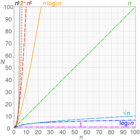

# Data Structures and Algorithms
**Data Structures** organise and store data. Some examples of it are arrays and trees.

**Algorithms** describe the steps you have to perform in order to accomplish a specific task. For
  example, a sorting algorithm.

## Big-O Notation
- The Big-O notation is a way of expressing the ***time complexity*** of an algorithm related to the
  `n` number of items it has to process:
  - O(1): Constant
  - O(log n): Logarithmic (base 2)
  - O(n): Linear
  - O(n log n): n log-star n (base 2)
  - O(n²): Quadratic
- When expressing time complexity, you should always refer to the worst case scenario. For example,
  if you have an array `[1, 5, 21, -5, 3, 6, 88]`, and would like to find the time complexity for
  searching the index of the number `21`, the appropriate time complexity would be *O(n)*,
  regardless of whether we know we can find the desired index at the third iteration.
- It is common for algorithms to contain small optimisations that slightly reduce the number of
  operations related to `n` as the algorithm progresses, however, we are not looking at the Big-O
  notation mathematically, what we want instead is an approximation to evaluate how efficient the
  algorithm is.
- A tip to discover the time complexity is to look at how many loops the algorithm has, for example:
  - 1 loop: O(n)
  - 1 outer loop with an inner loop: O(n²)
  
> The right way of reading the notation is "O of 1, O of log n", etc

> *Binary logarithms* (log n) are the inverse function of the power of two `n²` function. They are
commonly used in binary search and related algorithms.

The chart below demonstrates the relation of the `n` number of elements against the `N` time needed
by different time complexity expressions:

## Recursion
- A recursive method is a method that calls itself.
- In order to recursion to work properly, you need a condition that ends the recursion. 
  This condition is know as the ***breaking condition***, or the ***base case***.
- When the recursive call satisfies the base case, one says the recursion *starts to unwind*.
- However, if no base case is provided, the recursive call stack will grow indefinitely and will
  resulting in a `StackOverflowError`.
- Usually, an iterative implementation (such as a *for* loop) runs faster and doesn't use as much
  memory than recursion. However, sometimes the iterative algorithm isn't as intuitive and as short
  as the recursive algorithm.
- Lastly, even when you provide a base case, you can face a `StackOverflowError` if the number of
  calls is too high. Languages such as Scala support
  [tail recursion](https://www.drdobbs.com/jvm/tail-call-optimization-and-java/240167044) which 
  optimises recursive calls, however, Java does not.
