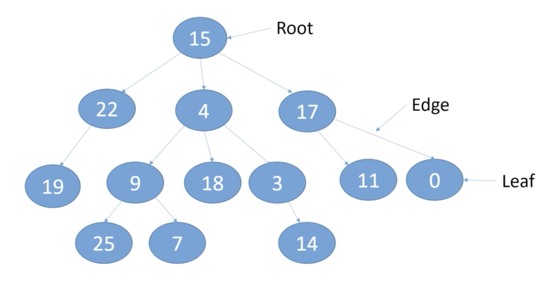

# Arrays
* ***Advantages***: Fast for retrieval if you know the index
* ***Disadvantages***: Slow for retrieval (search) if you don't know the index.

- Once created, its size specified during creation (or inferred during initialisation) doesn't
  change.
- Arrays are stored in a contiguous block in memory.
- Every element of an array uses the same amount of memory.
- Arrays are memory efficient because they only store the value with no additional information.
- If an array starts at memory address `x`, and the size of each element in the array is `y`, we can
  calculate the memory address `a` of the `i` ith element by using the expression `a = x + i * y`.
- If we know the index of an element, the time to retrieve the element will be the same, no matter
  where it is in the array.
- That means that if we know the index `i` of an element, arrays are fast for retrieving data.

***Example***: given an array with the start address of `x = 12` in memory, and an element size of `y = 4` bytes, the
formula `a = x + i * y` applies as follows:
```
array = [20, 35, -15, 7, 55, 1, -22]

address of array[0] = 12 + (0 * 4) = 12
address of array[1] = 12 + (1 * 4) = 16
address of array[2] = 12 + (2 * 4) = 20
address of array[3] = 12 + (3 * 4) = 24
address of array[4] = 12 + (4 * 4) = 28
address of array[5] = 12 + (5 * 4) = 32
address of array[6] = 12 + (6 * 4) = 36
```

### Operations
If the operation requires a loop, then the complexity is O(n); if it doesn't require a loop, then
it's O(1).
```
| Operation                                       | Time Complexity |
|-------------------------------------------------|-----------------|
| Retrieve with index                             | O(1)            |
| Retrieve without index (search)                 | O(n)            |
| Add an element to a full array                  | O(n)            |
| Add an element to the end of a not full array   | O(1)            |
| Insert or update an element at a specific index | O(1)            |
| Delete an element by setting it to 0, null, etc | O(1)            |
| Delete an element by shifting elements          | O(n)            |
```

#### Retrieval with index
Time complexity is ***O(1)***:
1. Multiply the size of the element by its index
2. Get the start address of the array
3. Add the start address to the result of the multiplication
```
| # of Elements | Steps |
|---------------|-------|
| 1             | 3     |
| 1000          | 3     |
| 1000000       | 3     |
```

#### Retrieval without index (Search)
Time complexity is ***O(n)***:
1. Loop over the array obtaining each element
2. Compare the element with the wanted value
```
| # of Elements |  Steps  |
|---------------|---------|
| 1             | 2       |
| 1000          | 2000    |
| 1000000       | 2000000 |
```

# Lists
- It's an abstract data type;
- It's an ordered collection (also known as sequence);
- It's good for random access (by index) as the operations are `O(1)`, but additional on a list out
  of capacity or at a specific index, and deletion are `O(n)`.
- The user has control where the element is inserted and can retrieve by its index;
- Popular implementations of List are *ArrayList* and *LinkedList*;
- To implement your own List, either extend `AbstractList` or `AbstractSequentialList`, as they give
  you a head start by providing a skeletal implementation. Read the javadoc of both class to decide
  which one to use.
  
## Vector
- Thread-safe array list, also backed by an array.
- Since its methods are synchronised, there is a performance hit;
- It was introduced at Java 1.0, before the popular ArrayList which was only introduced at Java 1.2;
- If you don't need synchronisation possibly due to using mostly read operations, prefer ArrayList;

## Singly Linked Lists
- The items are called *nodes*;
- The first node is called *head*, as in head of the list;
- Every node, besides carrying its data, carries a reference (link) to the next node;
- The last node is called *tail* always point to `null`, because nothing comes after it;
- The list has only to store the reference of the first node (head);

> *Circular Linked List*
>
> It's a variation of Singly Linked List, where the last node points to the head node, so you can
> transverse the whole list starting at any point.

#### Insertion O(1)
You only insert elements at the front of the list, otherwise you would need to transverse all nodes
until you get to the last node.
1. Create the new node;
2. Assign the current head node as the link of the new node;
3. Assign the new node to the head of the list;

#### Deletion O(1)
You also want to delete from the front of the list, so you don't have to transverse all nodes
1. Obtain the head node;
2. Assign the *next* field of the head node to the List's head node;

## Doubly Linked Lists
- In spite of having a **head** node reference, it also has a **tail**;
- every node in the list has a link to the *next* and *previous* node;
- Operations on either head or tail nodes are O(1);

#### Insertion at head O(1)
1. Create the new node;
2. Assign the current head node as the next of the new node;
3. Assign the previous field of the current head node as the new node;
4. Assign the new node to the head of the list;

#### Insertion at tail O(1)
1. Create the new node;
2. Assign the current tail node as the previous node of the new node;
3. Assign the next field of the current tail node as the new node;
4. Assign the new node to the tail of the list;

#### Deletion from head O(1)
1. Obtain the head node;
2. Assign the *next* field of the head node to the List's head node;
3. Set the *previous* field of the new head node to `null`;

#### Deletion from tail O(1)
1. Obtain the tail node;
2. Assign the *previous* field of the tail node to the List's tail node;
3. Set the *next* field of the new tail node to `null`;

# Stacks
- It's an abstract data type;
- LIFO: Last In, First Out;
- Standard operations are:
  - **Push**: adds an item to the top of the stack;
  - **Pop**: removes the top item of the stack;
  - **Peek**: gets the top item of the stack without popping it
- A *linked list* is the ideal backing data structure for a stack, however, it is possible to 
implement it with any data structure;
- An *array* would be a good choice **if**:
  - You know the maximum number of items the stack will hold;
  - Memory is tight.
- A stack is the perfect data structure for using with a method call stack;

### Stack Operation Costs
```
| Operation |   Linked List   |        Array List        |
|-----------|-----------------|--------------------------|
| Push      | O(1)            | O(1) or O(n) with resize |
| Pop       | O(1)            | O(1)                     |
| Peek      | O(1)            | O(1)                     |
```

# Queues
- It's an abstract data type;
- FIFO: First In, First Out;
- Standard operations are:
  - **Enqueue (Add)**: adds an item to the end of the queue;
  - **Dequeue (Remove)**: removes the item at the front of the queue;
  - **Peek**: gets the item at the front of the queue, without removing it;
- Two popular data structures for implementing queues are *arrays* and *linked lists*
- *Linked list* implementations provide all operations with O(1);
- *Array* implementations, similarly to stack array implementations, provide the operations with 
  O(1) if no resize is needed, O(n) otherwise.

### Queue Operation Costs
```
|     Operation    |   Linked List   |        Array List        |
|------------------|-----------------|--------------------------|
| Enqueue (Add)    | O(1)            | O(1) or O(n) with resize |
| Dequeue (Remove) | O(1)            | O(1)                     |
| Peek             | O(1)            | O(1)                     |
```

# Hashtables (Maps, Dictionaries)
- It's an abstract data type;
- Consists of key/value pairs;
  - Keys could be of any type
  - Values could also be of any type and don't have to match the key types 
- Optimised for retrieval when you know the key
- A common data structure for backing a hashtable is an array, but any structure could be used.
- The key for better performance on a hash table is to provide a good hashing algorithm, which
  distributes the stored values as consistently as possible across the underlying storage structure.

### Hashing
- Keys of any data type are hashed to int by using a hash function;
- In Java, the hash function is `Object.hashCode()`;
- A *collision* is when more than one value has the same hashed value.

### Load Factor
- Tells us how full a hash table is: `f = size / capacity`
- It is used to decide when to resize the array backing the hash table;
- Low load factors leave lots of empty space, whereas high load factors increase the likelihood of 
  collisions;
- Plays a role in determining the time complexity for retrieval.

### Collision Handling Strategies
A collision is when two or more keys hash into the same int value. In order to store these values,
these collisions can be handled with:
  1. **Linear Probing**, which is an *Open Addressing* strategy, where we look for the next 
     available position if the desired position has already been taken.
  2. **Chaining**, where each of the underlying array's position contains a *LinkedList*, so when
     a collision happens, the new element is simply added to the LinkedList at the hashed index.

#### Collision Handling with Linear Probing
- If the hash position has already been taken, we keep adding `1` to the hash value until we find an
  available position or discover the hash table is full.
- Say we had to add `1` three times to the hash, we could say we had to use *three probes*.
- The lower the number of probes, the better.

#### Chaining
- Simpler than linear probing;
- Each linked list at a given index acts similarly to a *bucket*, that keeps elements of the same
  hash.

### Hashtable Operations
#### Put
1. Provide a key/value pair;
2. Use the hash function to hash the key into an int value;
3. If a collision happens, use an underlying algorithm to find a new available key;
4. Store the value at the key hashed value, which is the index of the array.

#### Get
1. Provide the key;
2. Use the same hash function to hash the key into an int value;
3. Lookup for the desired value by comparing the not hashed key starting at the hashed key index.
4. Retrieve the value stored at the hashed key value.

#### Remove
1. Provide the key;
2. Use the same hash function to hash the key into an int value;
3. Set the value stored at the hashed key as null;
4. Rehash the element data storage if linear probing is being used.

### Hashtable Operation Costs
The table below demonstrates the time complexity of the Hashtable operations, when no hash key
collision happens and when they happen and are handled by a specific algorithm.
```
| Operation | No Collision | Linear Probing |   Chaining    |
|-----------|--------------|----------------|---------------|
| Put       | O(1)         | O(n)           | O(1+k) - O(n) |
| Get       | O(1)         | O(n)           | O(1+k) - O(n) |
| Remove    | O(n)         | O(n)           | O(1+k) - O(n) |

k: average length of the linked lists in a chained hash table
```

# Trees
- Trees could be classified as either data structures or abstract data types, since it is possible
  to back a tree using an array. For the sake of the exercise, we will look into them as a data
  structure.
- Tree is a hierarchical data structure.

### Tree's basic terminology:


- Every **circle** in a tree is a node;
- Nodes are connected by **edges** (arrows);
- Each node can have *one and only one* **parent**;
- Every tree has the special unique node **root**, which has no parents and is the starting point;
- Each node can have *multiple* **children** nodes;
- A **leaf** is a node with no children;
- The **depth** of a node is the number of *edges* from the node to the root. The depth of the root
  node is always `0`;
- The **height** of a node is the number of *edges* on the *longest path* from the node to a leaf.
  The height of leaf nodes is always `0`;
- The height of a tree is the height of the root node;
- A **level** of a tree contains all the nodes that are on the same *depth*, where `depth == level`;
- An **ancestor** of a node is every node on the node's ascending path, including the root node;
  
### Tree's additional terminology:
- Every tree consists of one or more sub-trees, from the Node of choice descending to its leaves;
- A *singleton tree* has only one node - the root;
- A **path** is a sequence of nodes required to go from one node to another.
- A **root path* is the ascending sequence of how to get from a specific node to the root node;
- You can't have cyclic paths, in other words, a path can't cross the same node more than once;

### Examples of trees:
  - The Java class model, where the root node is the `Object` class;
  - A file system, where the root node is the `/` folder;
